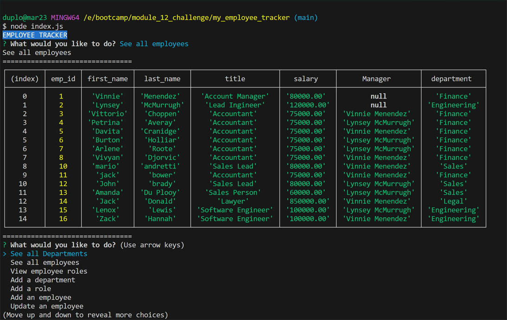

# My Employee Tracker

## Description

This project challenged me to use a mysql database 
and interact with it using node.js.

During this project I learned how to:

- create a mysql database.
- make a connection with the database.
- create tables in fill it with data.
- use mysql workbench
- using CRUD operations on the database.
- use the mysql2 package.
- use the inquirer package to interact with database.

## Table of Contents:

[Installation](#Installation)
[Video Link](#video)
[Usage](#usage)
[Credits](#credits)
[License](#license)

## Installation 

 Clone repository to local machine
- run npm install
- To start the progam run: node injex.js
  
## Video

## Usage

This app provides an easy and accessible command-interface 
for a business owner to view and manage the departments, roles, and employees in his/her company.

## Screenshot of app

## Credits: Resources used

I used and modified code from the following resources:

https://www.youtube.com/watch?v=344Zv2m9TYI

https://www.youtube.com/watch?v=tIV90xQ0k6A

https://stackoverflow.com/questions/60130169/not-showing-tables-with-null-value-when-i-select

https://www.npmjs.com/package/mysql2

https://www.youtube.com/watch?v=7S_tz1z_5bA

## License

MIT
